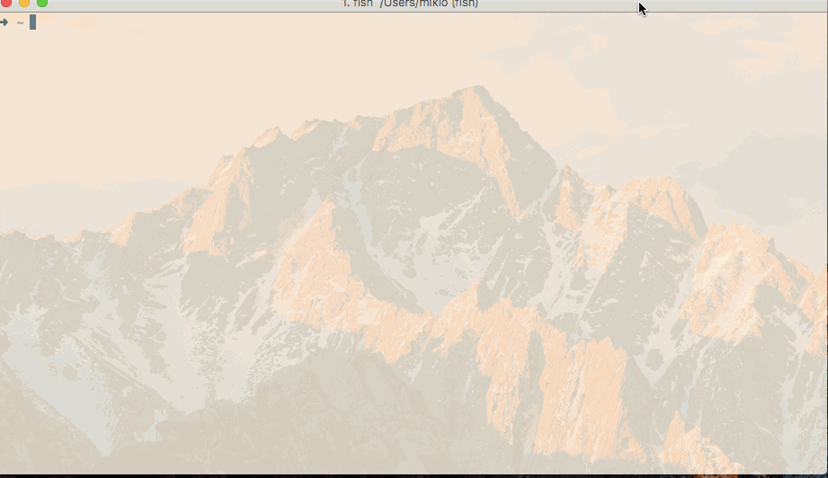

# uecq

Command line tool to get UEC Kyuuko information. [電気通信大学(学域・学部) 休講のお知らせ](http://kyoumu.office.uec.ac.jp/kyuukou/kyuukou.html)

## Description
'uecq' is a command line tool to get the cancelled lectures list in UEC. You can get json format data of the lectures list.

## Demo


## Usage

``` shell
$ uecq -help
Usage of uecq:
  -f string
    	Setting output format. (default "text")
  -graduate
    	Set graduate school mode flag.
  -version
    	Print version information and quit.
```

## Install

To install, use `go get`:

```bash
$ go get -d github.com/benevolent0505/uecq
```

So, uecq requres `go`.

## Contribution

1. Fork ([https://github.com/benevolent0505/uecq/fork](https://github.com/benevolent0505/uecq/fork))
1. Create a feature branch
1. Commit your changes
1. Rebase your local changes against the master branch
1. Run test suite with the `go test ./...` command and confirm that it passes
1. Run `gofmt -s`
1. Create a new Pull Request

## Author

[benevolent0505](https://github.com/benevolent0505)
